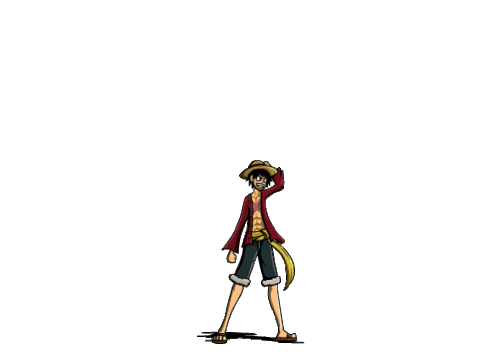

<!-- Greetings text: https://readme-typing-svg.demolab.com/demo/ make your own -->
<h1 align="center">
	Hi , I'm 
	 
	
</h1>

<!-- Custom Gif made with canva, qr codes from searching "qr code generator" on google -->

<!-- About me section starts here -->
<!-- About me heading -->

	<samp style="font-size:40px;">
		<!--  -->
		 About Me
	</samp>

<!-- Divider -->

<!-- About me Body -->

<!-- Current Occupation -->
-   
    <!--  -->
    
    I’m a <b style="color:orange">Full Stack Developer</b> at
	<a href="https://in.sugarcosmetics.com/">
		<b style="color:#5ED3F3;">Vellvette Lifestyle Pvt. Ltd.</b>
	</a>
    

	-	

			

				 Holding company and Best known for
				<b style="color:#F9B;">Sugar Cosmetics</b>
			

		-   <b style="color:#F9B;">Fab Bag</b>
		-    
		-   <b style="color:#F9B;">Sugar POP</b>
		-    
		-   <b style="color:#F9B;">Quench Botanics</b>
		-    
		-   <b style="color:#F9B;">ENN Beauty</b>
		-    
        

<!-- Current Tech Stack -->
-   
    	<!--  -->
	
	I’m currently working on and Learning <b style="color:orange;">Next.js</b>
    

<!-- Available for -->
-   
    	<!--  -->
	
	I’m available for <b style="color:orange;">Freelancing</b> and <b style="color:orange;">Contract work</b>
    

<!-- Looking for -->
-   
    
	Looking for <b style="color:orange;">Open Source</b> projects to contribute to.
    

<!-- Portfolio -->
-	
	
	All of my live Projects can be accessed through
	<a href="https://github.com/abhi-aro/"><b style="color:#5ED3F3;">GitHub</b></a>
    or
	<a href="https://abhi-aro.tech/"><b style="color:#5ED3F3;">My Portfolio</b></a>
	

<!-- Interests -->
-	
	
	Talk to me about <b style="color:orange;">Web Development</b>
    or
	<b style="color:orange;">Gaming</b>
    or
	<b style="color:orange;">One Piece</b>
    

<!-- Resume -->
-	
	
	Know about my experiences <a href="./Readme/Files/Resume.pdf"><b style="color:#5ED3F3;">Resume</b></a>

<!-- Reach me -->
-	
	
	How to reach me
	<a href="mailto:abhiaro27@gmail.com"><b style="color:#5ED3F3">Abhiaro27@gmail.com</b></a>
    or
	<a href="https://www.linkedin.com/in/abhi-aro/"><b style="color:#5ED3F3">LinkedIn</b></a>

<!-- Divider -->

<!-- About me section ends here -->

<!-- GitHub Stats Section Starts here-->

<!-- Stats Heading -->

	<!--  -->
	
	

	

	

	
	

	

<!-- GitHub Stats Section Ends here-->

<!-- Divider -->

<!-- Visitors Section Starts here -->

<!-- Visitors Heading -->

	

		<!--  -->
		
		
	

	

<!-- Visitors Count -->

<h3 align="center" >
	<!--  -->
	
	Connect with me
	
</h3>

<!-- Socials  -->

	
	
	
	
	
	
	
	
	

	
		<b><i align="center">Thought : "Not everything's a lesson, Ryan. Sometimes you just fail."</i></b>
	

<!-- Visitors Section Ends here -->

<!-- 麦わら -->

	

<!-- Divider -->

	
	
	
	
	
	

